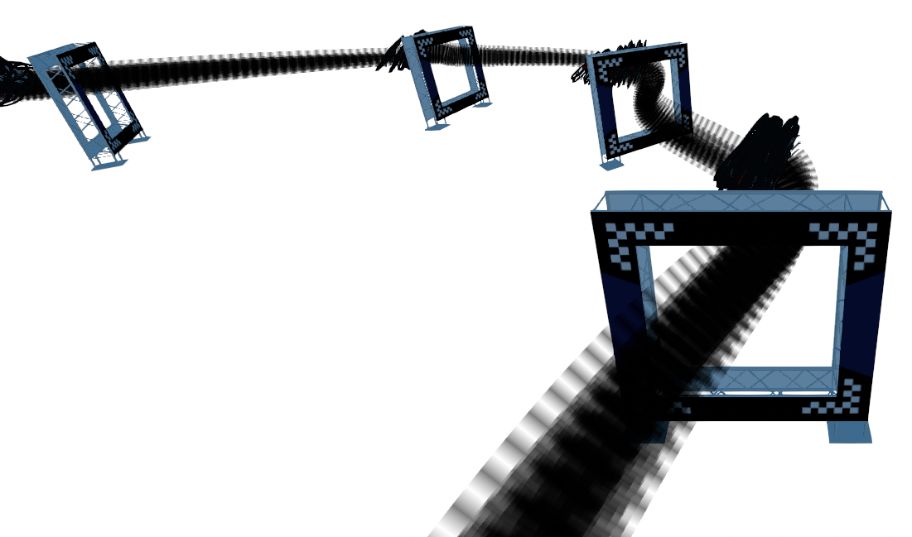
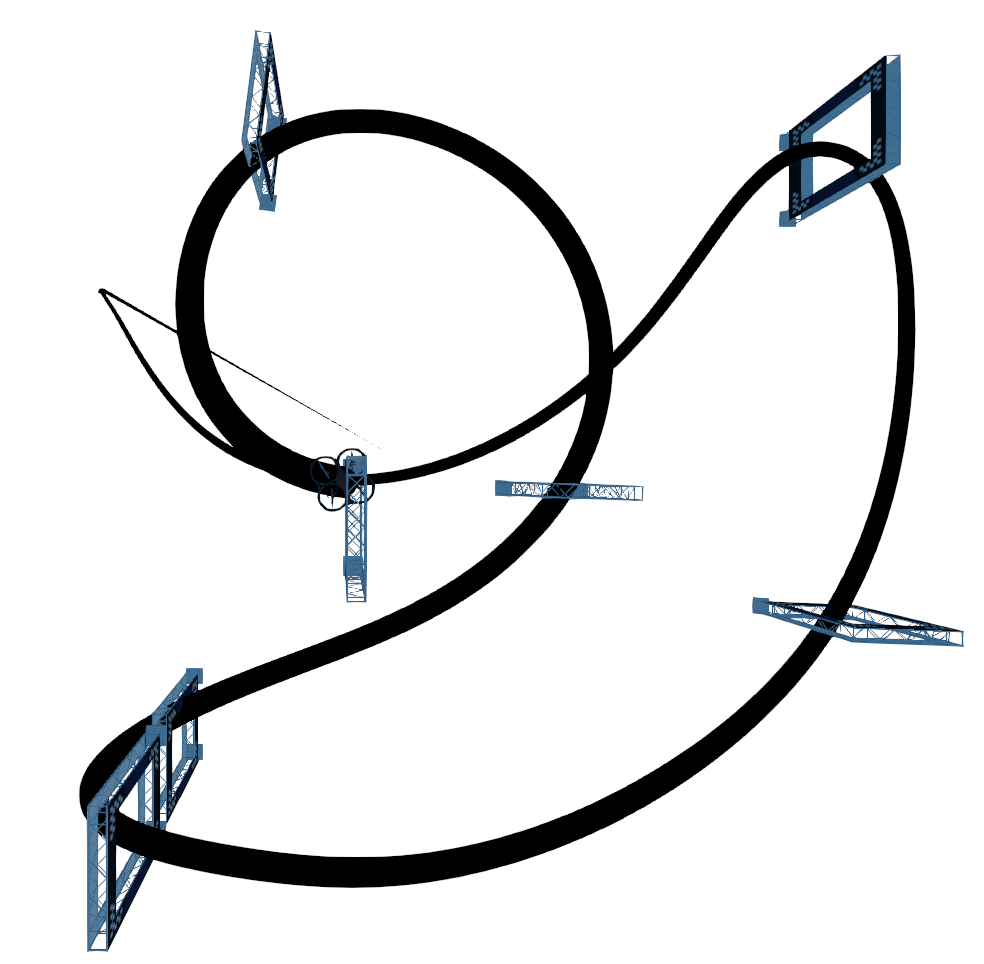

# HelixRL
                   


RL unity flightmare simulation for quadrotor drone racing and control. This code the extension of the https://github.com/uzh-rpg/flightmare , we made several changes on the top of flighmare simulator codes.

```bash
git clone https://github.com/zsxacdvbbnm16/HelixRL

cd HelixRL

export FLIGHTMARE_PATH=$(pwd)

cd flightlib
mkdir -p build && cd build
cmake ..

cd ../..
pip3 install -e flightlib

```

Rebuild `flightlib` whenever you change C++ env code and dont forget to setup you racing environment in quadrotor_env.cpp before rebuilding flightlib.

## PPO_PER

```bash
cd /flightmare
python3 flightrl/examples/ppo2_per.py
```
